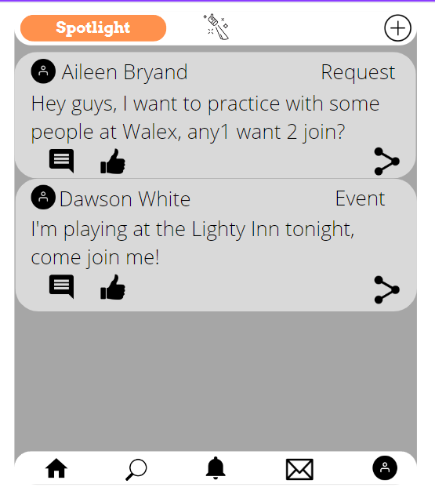
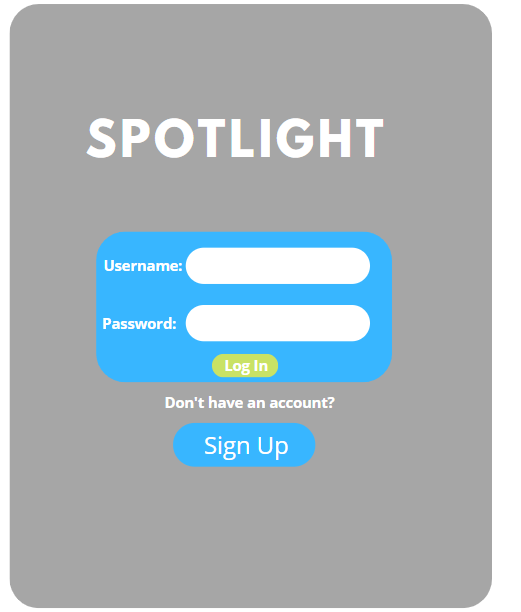
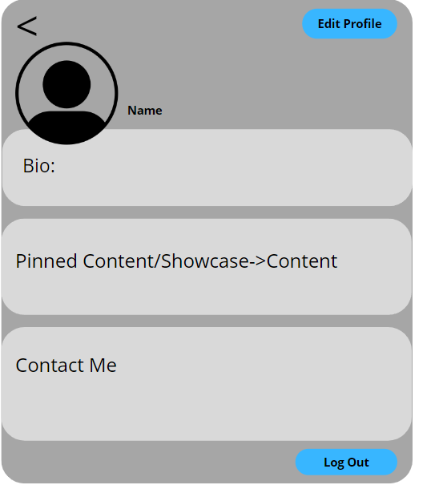

# Spotlight

## Currently undergoing face lift for conversion to desk top ui

### 

Spotlight is a social media that has a focus in artists, musicians, bands, and other similar things! [See the official phone-based application here!:](placeholder)

## Table of Contents:

- [Getting Started](#getting-started)
- [Deployment](#deployment)
- [Built With](#built-with)
- [Authors](#authors)

### Homepage

  

### An Example of a Post

  
  
### Notifications

  

## Getting Started

https://github.com/cade-coleman/Spotlight.git

These instructions will get you a copy of the project up and running on your local machine for development and testing purposes. See deployment for notes on how to deploy the project on a live system.

1. Within GitHub, navigate to the main page of the repository.

2. Click the Clone or download button.

3. Copy the clone URL for the repository.

4. Open Terminal or CMD Prompt(Windows).

5. Change your current working directory to the location where you'd like the cloned directory be stored.

6. Type git clone, and then paste the URL you copied in Step 3.

7. git clone https://github.com/cade-coleman/Spotlight

8. Press Enter and a new local cloned repository will be created. 

### Browser support

| Chrome | 
| --- | 
| 24+ | 

## Deployment

In addition to being deployed on heroku for a limited time, you can locally host this application through one of your local device's PORTs!

1. Run npm run develop in the command line/terminal. Once the server is running, 

2. Navigate to localhost:{'selected PORT'} in your desired browser

## Built With

* [React](https://reactjs.org/)
* [Express](https://expressjs.com/)
* [Mongo DB](https://www.mongodb.com/)
* [Tailwind CSS](https://tailwindcss.com/)
* [Google Fonts](https://fonts.google.com/about)
* [Adobe Color](https://color.adobe.com/)

## Authors

* **Austin Murray** - [GitHub](https://github.com/Austinjm121)
* **Aileen Bryand** - [GitHub](https://github.com/aileenbryand)
* **Cade Coleman** - [GitHub](https://github.com/cade-coleman)
* **Dawson White** - [GitHub](https://github.com/TheTrueMop)

## Development

As with any project, we started with just our ideas. Our ideas of how we wanted the app to look are below:

### Home Screen:

  

### Sign up/Sign in page:

  

### Account page

  
